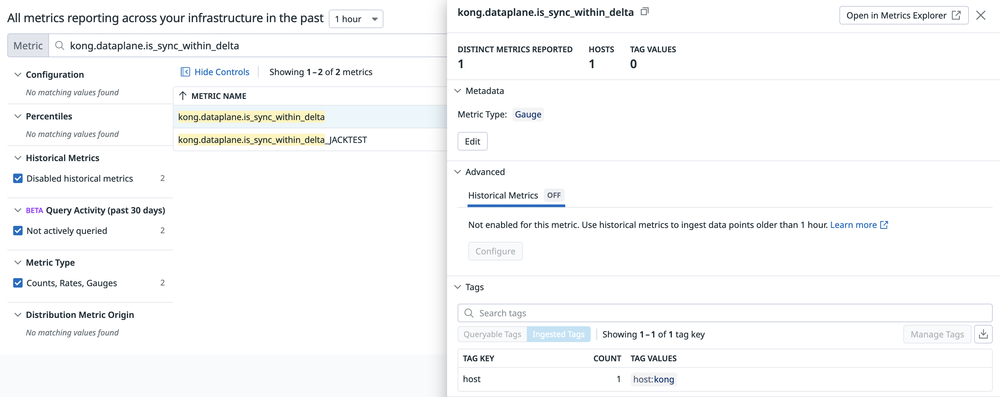
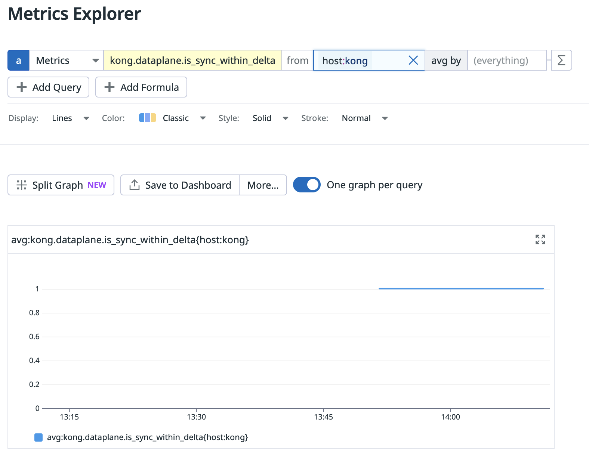

# Custom Datadog Metric: Data Plane Sync Status

Custom Datadog check (Python SDK) for determining whether the Data Plane is in sync or not.

# Installation

## Konnect PAT

1. Create a Konnect system account.
2. Give it "Viewer" role on the control plane to be monitored.
3. Create a token, and write it down.

## Python Custom Check Script

Copy the `dataplanesync.py` file to:

```sh
/etc/datadog-agent/checks.d/dataplanesync.py
```

Adjust the `__GAUGE__` field to a custom name, if required.

## Datadog Check Hook

Copy the `dataplanesync.yaml` file to:

```sh
/etc/datadog-agent/conf.d/dataplanesync.yaml
```

Add the correct parameters:

```yaml
init_config:
instances:
  - min_collection_interval: 60
    konnect_token: spat_abc  # Konnect PAT here - needs "Viewer" role
    konnect_control_plane_name: test-control-plane  # Control Plane name here
    konnect_region: us  # Region here
    kong_status_url: http://127.0.0.1:8100/status  # This can be used to target remote instances, if required
```

## Start the Check

Restart the Datadog agent:

```sh
systemctl restart datadog-agent
```

## Verify

Check that the custom metric has run **properly**:

```
datadog-agent check dataplanesync
=== Series ===
[
  {
    "metric": "kong.dataplane.is_sync_within_delta",
    "points": [
      [
        1710338356,
        1
      ]
    ],
    "tags": [],
    "host": "kong",
    "type": "gauge",
    "interval": 0,
    "source_type_name": "System"
  }
]
=========
Collector
=========

  Running Checks
  ==============

    dataplanesync (1.0.0)
    ---------------------
      Instance ID: dataplanesync:3f15d669f7810a34 [OK]
      Configuration Source: file:/etc/datadog-agent/conf.d/dataplanesync.yaml
      Total Runs: 1
      Metric Samples: Last Run: 1, Total: 1
      Events: Last Run: 0, Total: 0
      Service Checks: Last Run: 0, Total: 0
      Average Execution Time : 3.72s
      Last Execution Date : 2024-03-13 09:59:16 EDT / 2024-03-13 13:59:16 UTC (1710338356000)
      Last Successful Execution Date : 2024-03-13 09:59:16 EDT / 2024-03-13 13:59:16 UTC (1710338356000)


  Metadata
  ========
    config.provider: file
    config.hash: dataplanesync:3f15d669f7810a34
```

**On an error**, you will see `[ERROR]`:

```
Collector
=========

  Running Checks
  ==============

    dataplanesync (1.0.0)
    ---------------------
      Instance ID: dataplanesync:3f15d669f7810a34 [ERROR]
      Configuration Source: file:/etc/datadog-agent/conf.d/dataplanesync.yaml
      Total Runs: 1
      Metric Samples: Last Run: 0, Total: 0
      Events: Last Run: 0, Total: 0
      Service Checks: Last Run: 0, Total: 0
      Average Execution Time : 11ms
      Last Execution Date : 2024-03-13 09:58:08 EDT / 2024-03-13 13:58:08 UTC (1710338288000)
      Last Successful Execution Date : Never
      Error: URL has an invalid label.
      Traceback (most recent call last):
        File "/opt/datadog-agent/embedded/lib/python3.11/site-packages/datadog_checks/base/checks/base.py", line 1224, in run
```

## Datadog Measurement

Now you can check the metric in Datadog UI.

First, go to https://app.datadoghq.com/metric/summary?filter=kong.dataplane.is_sync_within_delta&metric=kong.dataplane.is_sync_within_delta and check that the metric is broadcasting:



Second, create a dashboard with a filter per-host, if you require:

